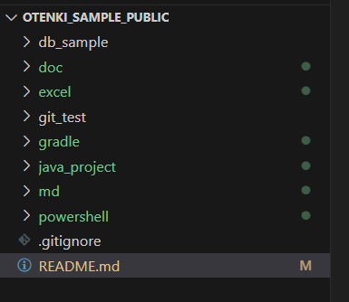

# 見出し 1

## 見出し ２
- info 1
  - info 1-1 
  - info 1-2
- info 2
  - info 2-1

## 見出し ３
1. 番号付きリスト１
2. 番号付きリスト２  
   
> 引用
> 
> 引用

## 見出し ４
    class Sample {
        public void main() {

        }
    }
***
~~~java
    class Sample {
        public void main() {

        }
    }
~~~

## 見出し ５
~~取り消し線~~

## 見出し ６

