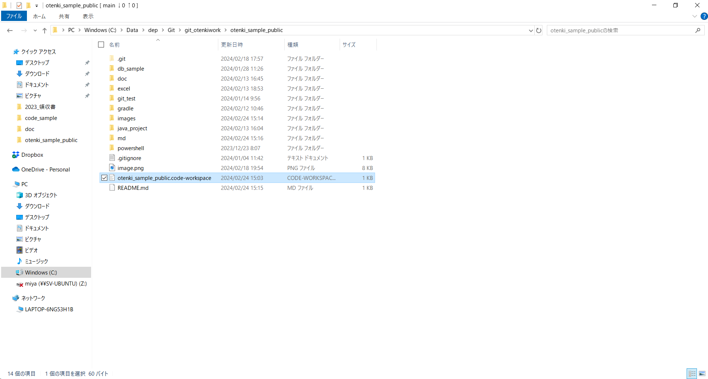
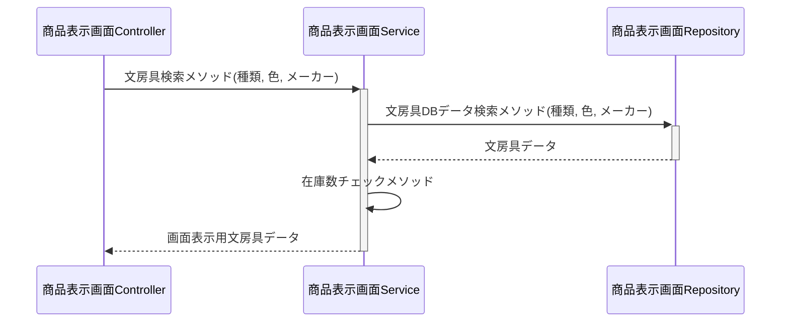

# 見出し

- 1
- 2
- 3

|日付 | カテゴリー | イベントテーマ | 
|    ---:   | :---: | :--- |
|2020/6/17 | 中央 | 左 | 

<table>
  <caption>HTMLの要素</caption>
  <thead>
    <tr>
      <th>名前</th> <th>説明</th>
    </tr>
  </thead>
  <tr>
    <td> table </td> <td>テーブル</td>
  </tr>
  <tr>
    <td> caption </td> <td>テーブルのキャプション</td>
  </tr>
</table>

