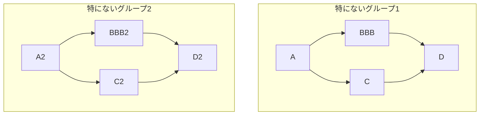
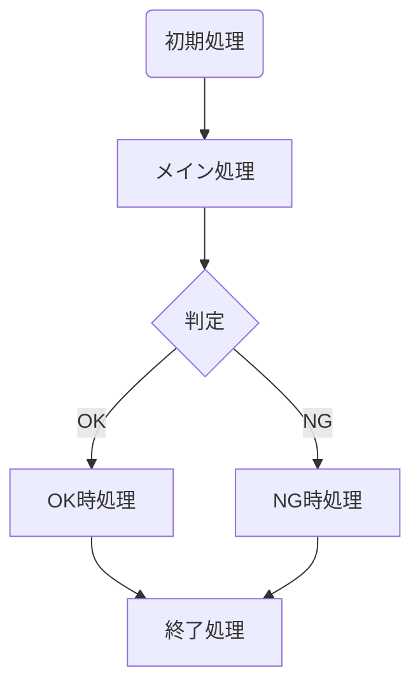

# 図 (mermaid を使用)

## サンプル１

```mermaid
graph TD;
subgraph 特にないグループ1
    A-->BBB;
    A-->C;
    BBB-->D;
    C-->D;
end

subgraph 特にないグループ2
    A2-->BBB2;
    A2-->C2;
    BBB2-->D2;
    C2-->D2;
end
```

## サンプル２

```mermaid
graph TD;
A(初期処理)-->B[メイン処理]
B-->BC{判定}
BC-->|OK| B1[OK時処理]
BC-->|NG| B2[NG時処理]
B1-->C[終了処理]
B2-->C[終了処理]
```
コメント