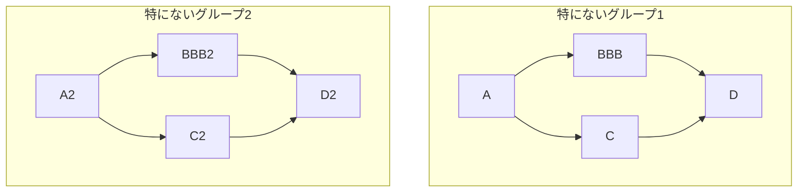
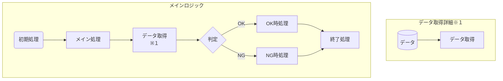
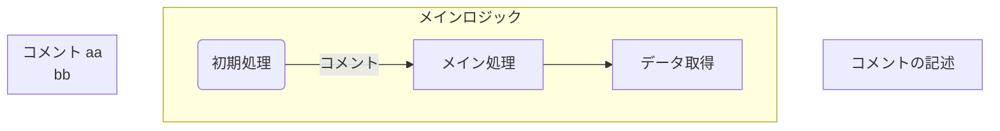

# 図 (mermaid を使用)

## サンプル１

```mermaid
graph TD;
subgraph 特にないグループ1
    A-->BBB;
    A-->C;
    BBB-->D;
    C-->D;
end

subgraph 特にないグループ2
    A2-->BBB2;
    A2-->C2;
    BBB2-->D2;
    C2-->D2;
end
```

## サンプル２

```mermaid
graph TD;
subgraph SUB[データ取得詳細※１]
DAT[(データ)]-->B1-SUB[データ取得]
end

subgraph メインロジック
A(初期処理)-->B[メイン処理]-->B1
B1[データ取得<br>※１]
B1-->CC{判定}
CC-->|OK| C1[OK時処理]
CC-->|NG| C2[NG時処理]
C1-->C[終了処理]
C2-->C[終了処理]
end

```

## サンプル３

```mermaid
graph TD;
subgraph メインロジック
A(初期処理)-->|コメント|B[メイン処理]-->B1
B1[データ取得]
end
コメントの記述

subgraph SUB2[
    コメント aa<br>bb
]
end


```
コメント